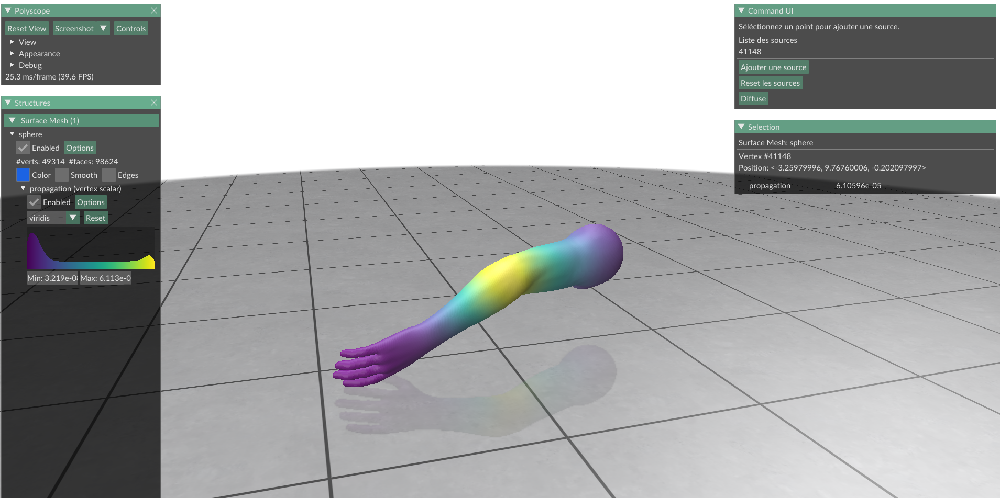

# PROJ602
Calcul de distances et de géodésiques sur des surfaces triangulées

## A quoi sert ce projet ?
Ce projet permet de diffuser la chaleur d'après une ou des sources sur un objet 3D. Attention, l'objet doit être triangulé et en un seul mesh.

## Quels sont les librairies utilisées ?
- [`numpy`](https://numpy.org/)
- [`matplotlib`](https://matplotlib.org/)
- [`scipy`](https://www.scipy.org/)
- [`polyscope`](https://polyscope.run/)

Pour les installer:

```sh
pip install numpy matplotlib scipy polyscope
```

## Comment lancer le projet ?
```sh 
python main.py path/fichier.obj
```
Le fichier obj doit être triangulé. Pour trianguler un obj, utiliser Blender. [Docs Blender](https://docs.blender.org/manual/fr/dev/modeling/modifiers/generate/triangulate.html)
Par defaut, si le chemin n'est pas précisé le projet utilise le fichier `./data/arm.obj`

## Une fois le programme lancé...


Avant la diffusion, il n'y a pas de source. Vous pouvez ajouter une source en cliquant sur un sommet puis en cliquant sur le bouton "Ajouter une source".

Une fois que vous avez diffusé, vous pouvez voir le résultat en cliquant sur le bouton "Diffuse".



Après une diffusion, on voit bien sur le coude qu'une source de chaleur a été placée et qu'elle s'est diffusée.

## Quelques exemples


## Influence des paramètres

###### L'objet 3D
Le nombre de triangles peut grandement influencer le temps de diffusion et la distance à laquelle la chaleur est diffusée.

###### La durée de diffusion (T) et l'intervale entre chaque étape de diffusion (dt)

Plus T est grand, plus la chaleur est diffusée. Plus le rapport T/dt est petit, plus la diffusion sera précise mais plus le temps de diffusion sera long.


